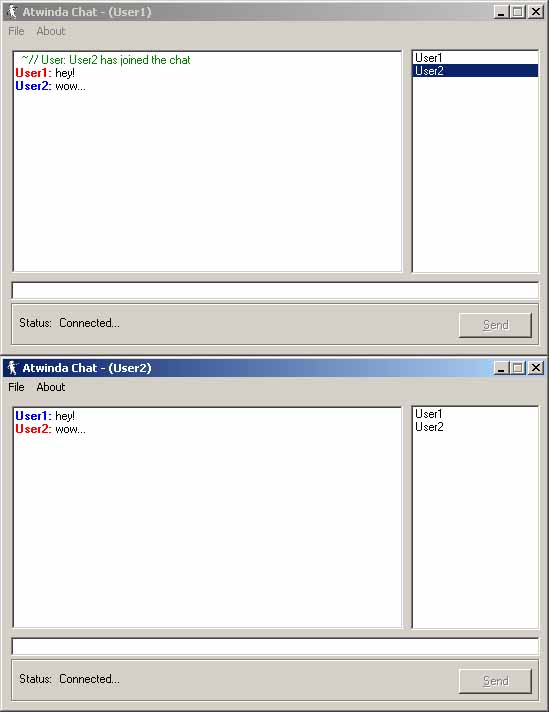



## Atwinda Network Chat v1 beta 1

### Description

This is a way good network chat program. The client is short a few features, but thats ok, it's a beta release! As of now, the client supports: Private Messeges, Display Correcting(for the richtextbox ocx), an advanced command prompt (only if you can find it), and Sounds.

The usernames and text, as you can see from the screenshot, are formated by color depending on usernames. The client features an AIM type signon window. 

 

I really didn't know if I should up this...

 

For now the Server will remain just a exe, without source. This is b/c I used the core of the server to create a new project which is still in development, and is due out in the next month or so, depending on the responce I get from this.

Both the server and client are available for download from my site, in an a setup file. 

 

http://atwindasoft.myqth.com 

 

As not to be rude, I am only gona ask once if you will vote. 

 

Please Vote!!! The server source is depending on it! 

 

Later 

~/Andy Stagg
 
### More Info
 

             |
---                |---
**Submitted On**   |2001-01-08 17:13:18
**By**             |[atwinda](https://github.com/Planet-Source-Code/PSCIndex/blob/master/ByAuthor/atwinda.md)
**Level**          |Advanced
**User Rating**    |4.0 (52 globes from 13 users)
**Compatibility**  |VB 5\.0, VB 6\.0
**Category**       |[Internet/ HTML](https://github.com/Planet-Source-Code/PSCIndex/blob/master/ByCategory/internet-html__1-34.md)
**World**          |[Visual Basic](https://github.com/Planet-Source-Code/PSCIndex/blob/master/ByWorld/visual-basic.md)
**Archive File**   |[CODE\_UPLOAD13559182001\.zip](https://github.com/Planet-Source-Code/atwinda-atwinda-network-chat-v1-beta-1__1-14263/archive/master.zip)

